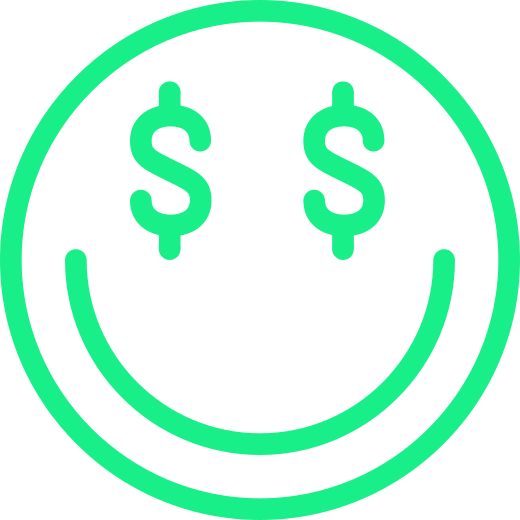
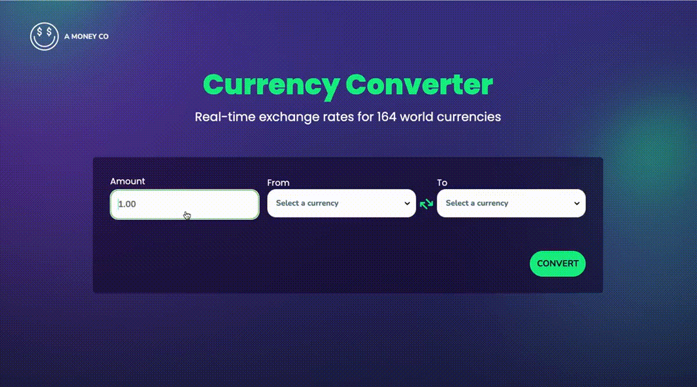
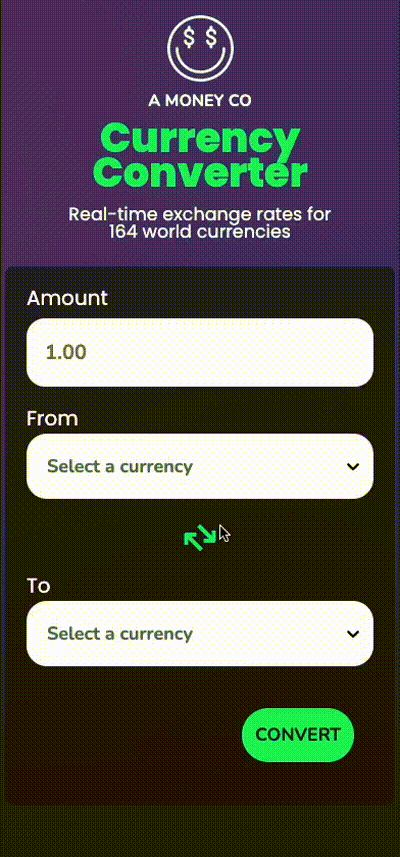
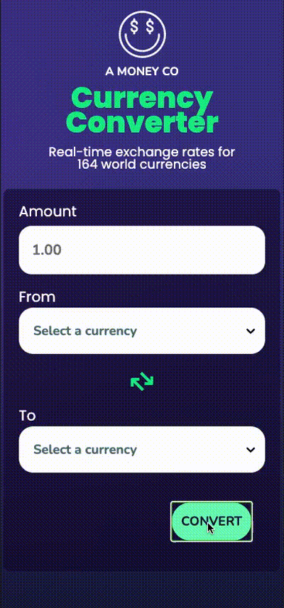
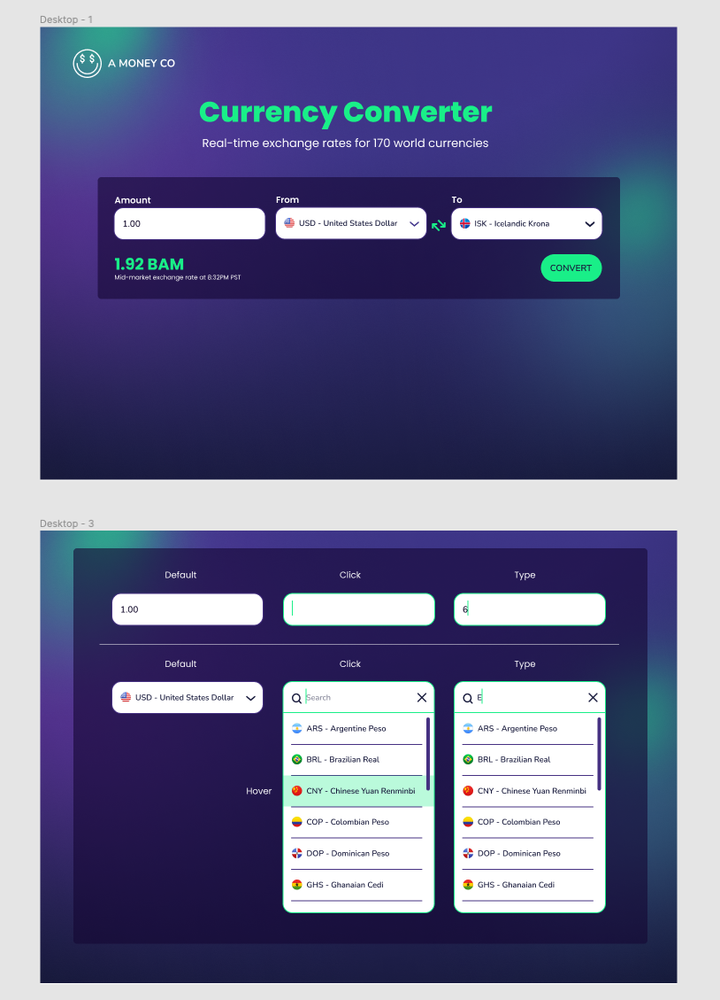
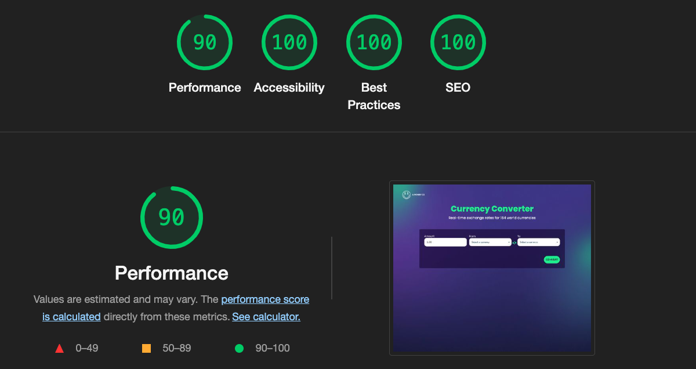

  <!-- Add your project logo if you have any -->
  

 
  <h1 align="center">Currency Converter</h1>
  

    <!-- Add your tagline or very short intro of your project -->
    Find exchange rates for 164 world currencies.
   
  <a href="[INSERT LINK HERE]">Currency Converter</a> 
  

 

      
  
  

 

<!-- Add your project demo gif here -->
  <h4 align="center">Desktop Demo</h4>
   
  

      
  

   
  

    
  

   
  

  <h4 align="center">Mobile version showing error handling</h4>
  
  

<!-- You may write notes in your readme this way if you want to, it looks good and also different from other text -->
 

<h3 align="center">A Money Co - Currency Converter. </h3>
 

## 🧐About

My spouse and I will be traveling to Ireland soon for a friends wedding. Travel planning inspired me to make a currency converter. A Money Co currency converter provides conversion rates for 164 world countries. Search by dropdown menu or currency name.
 

## 💡Features

- Find Conversion rates for 164 world countries.
- Rates are based on mid-market exchange rates
- Mobile friendly design

 

## ⛏️Built with

- JavaScript
- HTML
- CSS
- React
- Git VCS
- GitHub Projects
- React-Select
- React-Spinners
- Emotion/React
- Figma

## 🏁Getting Started

<a href="[INSERT LINK HERE]">See it in action</a>
 

## 🗓Planning and challenges

I began planning by reviewing the API documentation provided by Fixer Currency. The purpose of the application was fairly straight forward, provide conversion rates based on a specific amount. This project didn't present many technical challenges regarding data retrieval. However, I was faced with stylistic challenges mostly in regards to adding images within the select input in a dynamic way. After reviewing React-Select documentation as well as other online resources I was able to find a solution. Throughout the project, I reviewed and refactored several parts of my code in order to minimize the size of certain components.

 

 

## 🔧Mock up, planning tools and scores

 

  <h2>Currency Converter comp</h2>
  
  <h2>Lighthouse scores</h2>
  

## 🎉Acknowledgement

- [Fixer API](https://rapidapi.com/fixer/api/fixer-currency/)
- [React-Select](https://react-select.com/home)
- [React Spinners](https://www.npmjs.com/package/react-spinners)
- [Emotion/React](https://emotion.sh/docs/@emotion/react)
- [Country Flag Images by Jonas Bröms - Graphical assets, files, code and documentation released under the MIT.Docs released under Creative Commons.](https://www.figma.com/@jonasbroms)

> \_**NOTE:** Please do not make excessive API calls as this is not a free API. API in use for application demonstration purposes only.
